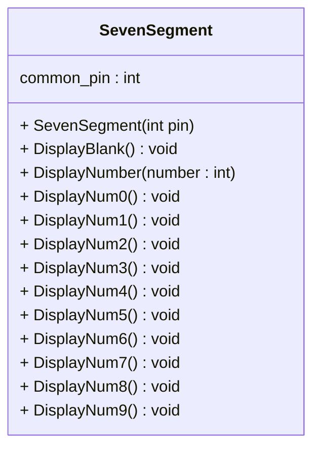
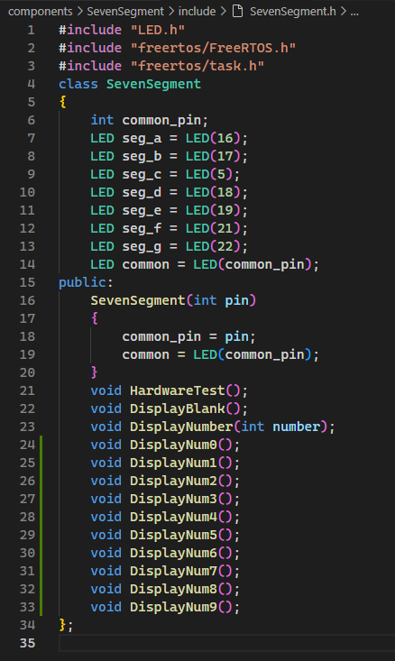
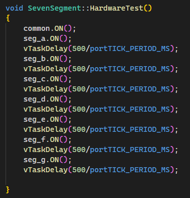
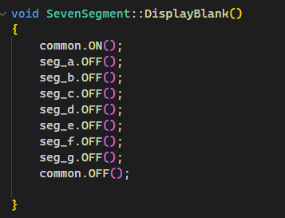
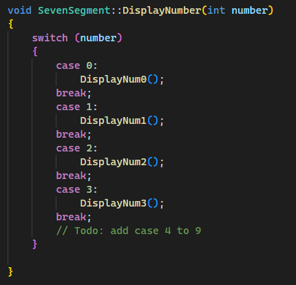
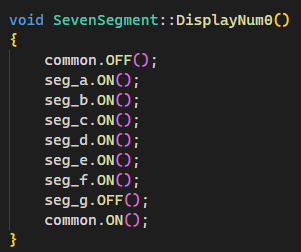
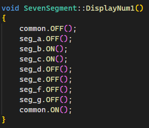
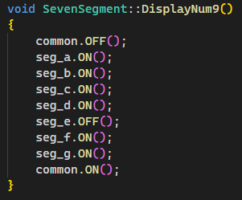

# Lab 07 Seven segment Component develope.

## 1. เพิ่ม functions ในคลาส sevent segment

จากใบงานที่ 6 ให้เพิ่ม  functions ในคลาส SevenSegment ดังต่อไปนี้


แต่ละ function มีหน้าที่ต่อไปนี้

|Function|Description|
|--------|-----------|
|SevenSegment(int pin)| Constructor ทำหน้าที่รับหลายเลข pin เข้ามาตอนสร้าง object และกำหนดทิศทางเป็น output|
| void DisplayNumber(number : int) | แสดงตัวเลขที่ป้อนทางพารามิเตอร์บน seven segment | 
| void DisplayNum0()   | แสดงเลข 0 บน seven segment |  
| void DisplayNum1()   | แสดงเลข 1 บน seven segment|
| void DisplayNum2()   | แสดงเลข 2 บน seven segment |
| void DisplayNum3()   | แสดงเลข 3 บน seven segment |
| void DisplayNum4()   | แสดงเลข 4 บน seven segment |
| void DisplayNum5()   | แสดงเลข 5 บน seven segment |
| void DisplayNum6()   | แสดงเลข 6 บน seven segment |
| void DisplayNum7()   | แสดงเลข 7 บน seven segment |
| void DisplayNum8()   | แสดงเลข 8 บน seven segment | 
| void DisplayNum9()   | แสดงเลข 9 บน seven segment |

### 1.1 แก้ไขไฟล์  sevensegment.h



### 1.2 แก้ไขไฟล์  sevensegment.cpp ดังต่อไปนี้

#### 1.2.1  ฟังก์ชัน `HardwareTest()`



#### 1.2.2  ฟังก์ชัน `DisplayBlank()`



#### 1.2.3  เพิ่มฟังก์ชัน `DisplayNumber(int number)`


#### 1.2.4  เพิ่มฟังก์ชัน `DisplayNum0()`


#### 1.2.5  เพิ่มฟังก์ชัน `DisplayNum1()` ถึง `DisplayNum9()` 
ใช้ตารางนี้ [(ตารางความจริง seven segment)](https://github.com/Special-Topic-2567/ESP32-Lab06-LED-7Segment-Component?tab=readme-ov-file#%E0%B8%95%E0%B8%B2%E0%B8%A3%E0%B8%B2%E0%B8%87%E0%B8%84%E0%B8%A7%E0%B8%B2%E0%B8%A1%E0%B8%88%E0%B8%A3%E0%B8%B4%E0%B8%87%E0%B8%AA%E0%B8%B3%E0%B8%AB%E0%B8%A3%E0%B8%B1%E0%B8%9A%E0%B8%81%E0%B8%B2%E0%B8%A3%E0%B9%81%E0%B8%AA%E0%B8%94%E0%B8%87%E0%B8%9C%E0%B8%A5%E0%B8%95%E0%B8%B1%E0%B8%A7%E0%B9%80%E0%B8%A5%E0%B8%82-7-%E0%B8%AA%E0%B9%88%E0%B8%A7%E0%B8%99) ในการเพิ่มฟังก์ชันแสดงเลข 1 ถึง 9 (ถ้ามีที่ผิด แก้ให้สามารถแสดงผลได้ถูกต้องด้วย)

ตัวอย่าง code แสดงเลข 1



ตัวอย่าง code แสดงเลข 9


จาก code สำหรับแสดงผลเลข 0 ถึง 9 นั้น เพื่อไม่ให้ LED ของ segment กระพริบและนำไปสู่การแสดงผลแบบแปลก ๆ ในขณะที่กำลัง ปิดและเปิดแต่ละ segment เราต้องปิดการแสดงผลด้วยคำสั่ง `common.OFF();` เมื่อเปลี่ยนแปลงแต่ละ segment ครบแล้ว ให้เปิด seven segment ด้วยคำสั่ง `common.ON();`

#### 1.2.6  แก้ไขไฟล์ main.cpp เพื่อทดสอบการทำงานของ seven segment

```cpp
#include <stdio.h>
#include "SevenSegment.h"

SevenSegment s1(0) ;
SevenSegment s2(4) ;

extern "C" void app_main(void)
{
    while(1)
    {
        s1.DisplayNum0();
        vTaskDelay(500/portTICK_PERIOD_MS);
        s1.DisplayNum1();
        vTaskDelay(500/portTICK_PERIOD_MS);
        s1.DisplayNum2();
        vTaskDelay(500/portTICK_PERIOD_MS);
        s1.DisplayNum3();
        vTaskDelay(500/portTICK_PERIOD_MS);
        s1.DisplayNum4();
        vTaskDelay(500/portTICK_PERIOD_MS);
        s1.DisplayNum5();
        vTaskDelay(500/portTICK_PERIOD_MS);
        s1.DisplayNum6();
        vTaskDelay(500/portTICK_PERIOD_MS);
        s1.DisplayNum7();
        vTaskDelay(500/portTICK_PERIOD_MS);
        s1.DisplayNum8();
        vTaskDelay(500/portTICK_PERIOD_MS);
        s1.DisplayNum9();
        vTaskDelay(500/portTICK_PERIOD_MS);
        s1.DisplayBlank();

        s2.DisplayNum0();
        vTaskDelay(500/portTICK_PERIOD_MS);
        s2.DisplayNum1();
        vTaskDelay(500/portTICK_PERIOD_MS);
        s2.DisplayNum2();
        vTaskDelay(500/portTICK_PERIOD_MS);
        s2.DisplayNum3();
        vTaskDelay(500/portTICK_PERIOD_MS);
        s2.DisplayNum4();
        vTaskDelay(500/portTICK_PERIOD_MS);
        s2.DisplayNum5();
        vTaskDelay(500/portTICK_PERIOD_MS);
        s2.DisplayNum6();
        vTaskDelay(500/portTICK_PERIOD_MS);
        s2.DisplayNum7();
        vTaskDelay(500/portTICK_PERIOD_MS);
        s2.DisplayNum8();
        vTaskDelay(500/portTICK_PERIOD_MS);
        s2.DisplayNum9();
        vTaskDelay(500/portTICK_PERIOD_MS);
        s2.DisplayBlank();
    } 
}
```

ิีbuild, flash และ run โปรแกรม 

บันทึกวิดิโอของ LED seven segment และแนบ link วิดีโอในไฟล์นี้
