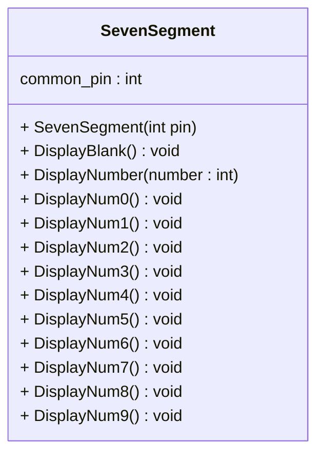

# Lab 07 Seven segment Component develope.

## 1. เพิ่ม functions ในคลาส sevent segment

จากใบงานที่ 6 ให้เพิ่ม  functions ในคลาส SevenSegment ดังต่อไปนี้

โดยให้แต่ละ function มีหน้าที่ต่อไปนี้

|Function|Description|
|--------|-----------|
|SevenSegment(int pin)| Constructor ทำหน้าที่รับหลายเลข pin เข้ามาตอนสร้าง object และกำหนดทิศทางเป็น output|
| void DisplayNumber(number : int) | แสดงตัวเลขที่ป้อนทางพารามิเตอร์บน seven segment | 
| void DisplayNum0()   | แสดงเลข 0 บน seven segment |  
| void DisplayNum1()   | แสดงเลข 1 บน seven segment|
| void DisplayNum2()   | แสดงเลข 2 บน seven segment |
| void DisplayNum3()   | แสดงเลข 3 บน seven segment |
| void DisplayNum4()   | แสดงเลข 4 บน seven segment |
| void DisplayNum5()   | แสดงเลข 5 บน seven segment |
| void DisplayNum6()   | แสดงเลข 6 บน seven segment |
| void DisplayNum7()   | แสดงเลข 7 บน seven segment |
| void DisplayNum8()   | แสดงเลข 8 บน seven segment | 
| void DisplayNum9()   | แสดงเลข 9 บน seven segment |

